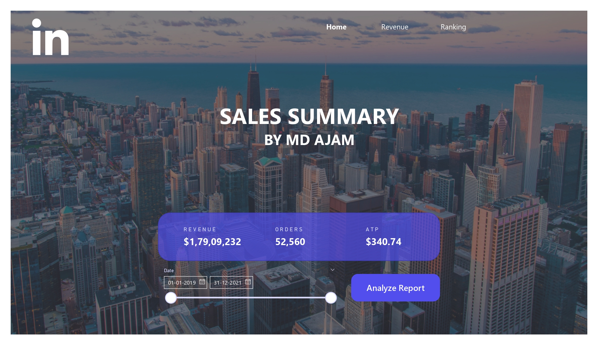
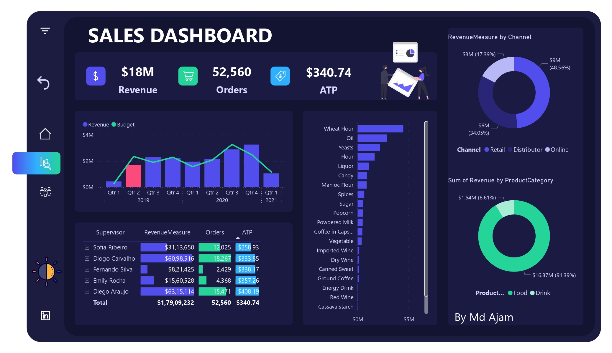
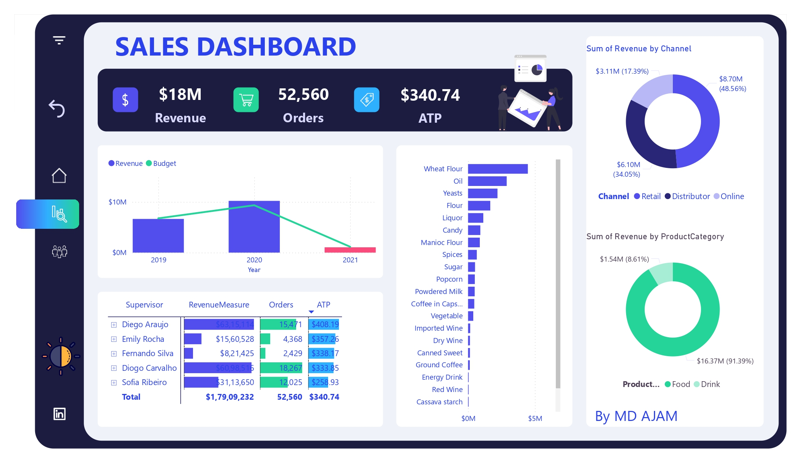
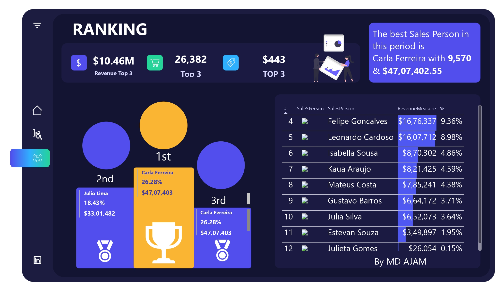

# 📊 Business Sales Performance Dashboard – Food & Beverage Industry  

## 📌 Project Overview  
This project demonstrates a **Sales Performance Dashboard** developed for the **Food & Beverage sector**.  
The goal was to help business leaders track **Revenue, Orders, Channel Contribution, Product Performance, and Sales Teams** with clear, data-driven insights.  
The dashboard is aligned with **business analyst practices** for fast-growing markets including **Saudi, Dubai, and India**.  

---

## 🎯 Key Business Insights  
- **Revenue Growth**: Achieved **$179M** in sales from 52,560 orders with an **Average Transaction Price (ATP) of $340.74**.  
- **Channel Analysis**: Retail, Distributor, and Online channels clearly highlight how **multi-channel strategies** impact overall performance.  
- **Product Insights**: Key revenue drivers are **Wheat Flour, Oil, and Yeast**, showing where the company should focus marketing and supply chain resources.  
- **Employee Performance**: Salesperson ranking identifies **top contributors**, supporting recognition and incentive planning.  
- **Target Achievement**: Sales exceeded expectations by **103.7% vs Budget**, reflecting effective business strategy execution.  

---

## 🛠️ Role of Business Analyst  
- **Requirement Gathering** – Defined KPIs with stakeholders for better alignment of business goals.  
- **Data Analysis & Interpretation** – Converted raw sales data into **business insights** for leadership.  
- **Visualization Storytelling** – Designed an intuitive **Power BI dashboard** that simplifies complex sales trends.  
- **Business Recommendations** – Suggested actions like **channel optimization, product prioritization, and employee performance evaluation**.  

---

## 📈 Business Value  
- Enables executives to **track performance vs budget in real-time**.  
- Helps management identify **market opportunities** in high-performing product categories.  
- Supports **decision-making for channel strategies and salesforce effectiveness**.  
- Provides a scalable reporting solution for **growing businesses across Saudi, Dubai, and India markets**.  

---
## 🖼️ Dashboard Preview  
Here’s a quick look at the **Power BI dashboard** designed for the **Food & Beverage industry in India**.  
It highlights **Revenue, Orders, Channels, Products, and Employee Performance** with clear insights.  

### 🔹 Main Dashboard View  

## 🛠️ Tools Used  
- **Power BI** – Dashboard design & visualization  
- **Excel / CSV** – Data sources  
- **Business Analysis Skills** – KPI definition, stakeholder communication, insights generation  

---

## 👤 Author  
**Md Ajam**  
Business & Data Analyst | Sales Performance | Power BI | SQL 

📩 Email: mdajamansari099@gmail.com  
🔗 [LinkedIn](https://www.linkedin.com/in/mdajam/) | [GitHub](https://github.com/MdAjams)  
