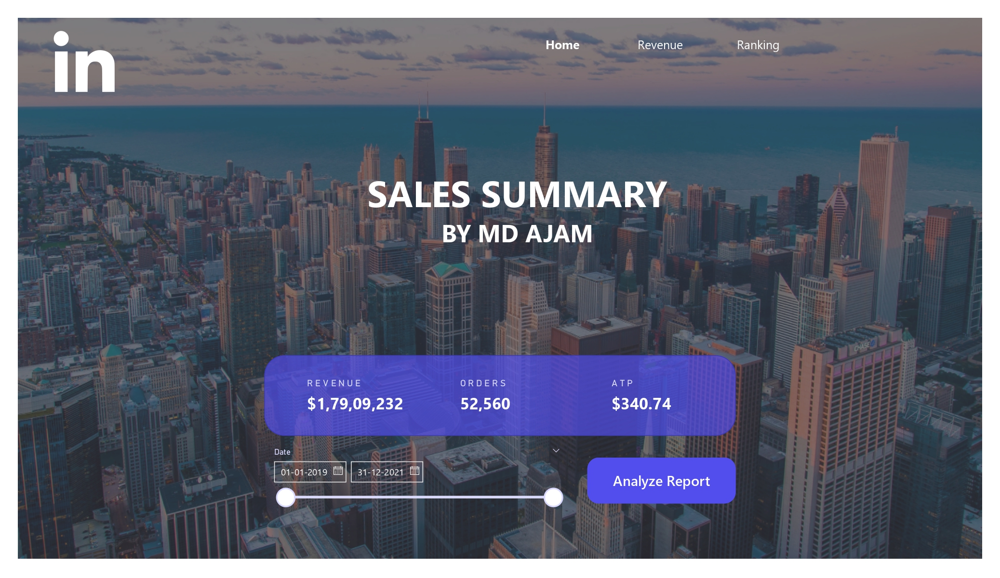
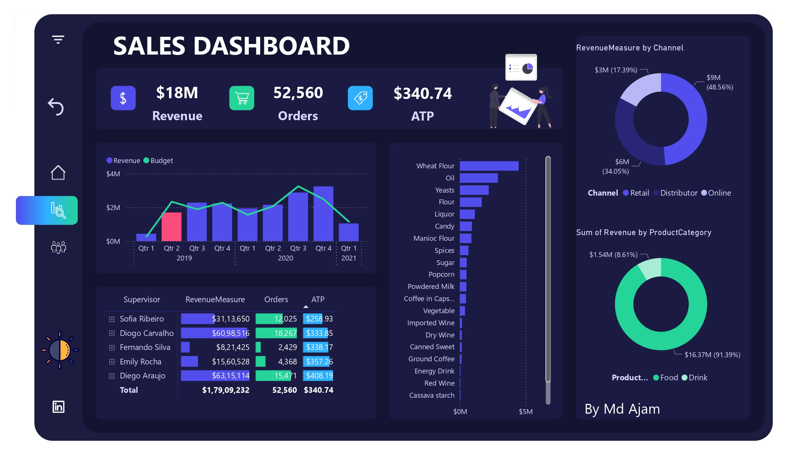
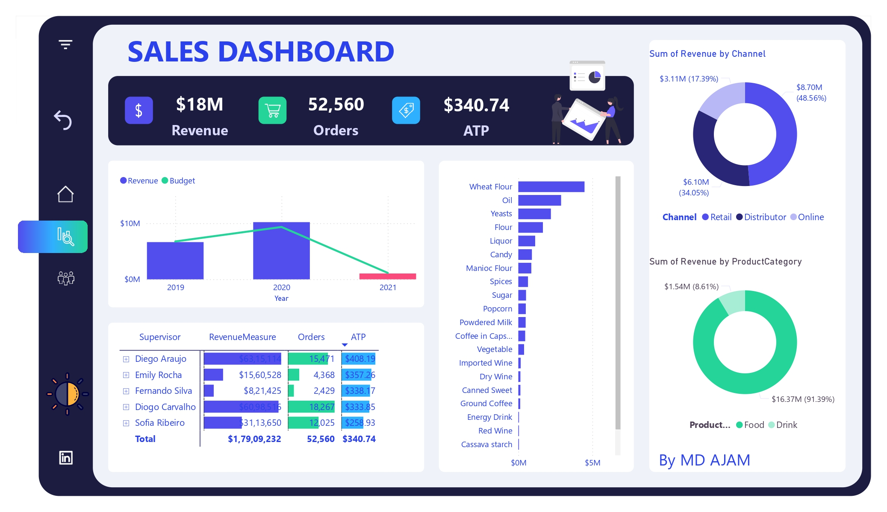
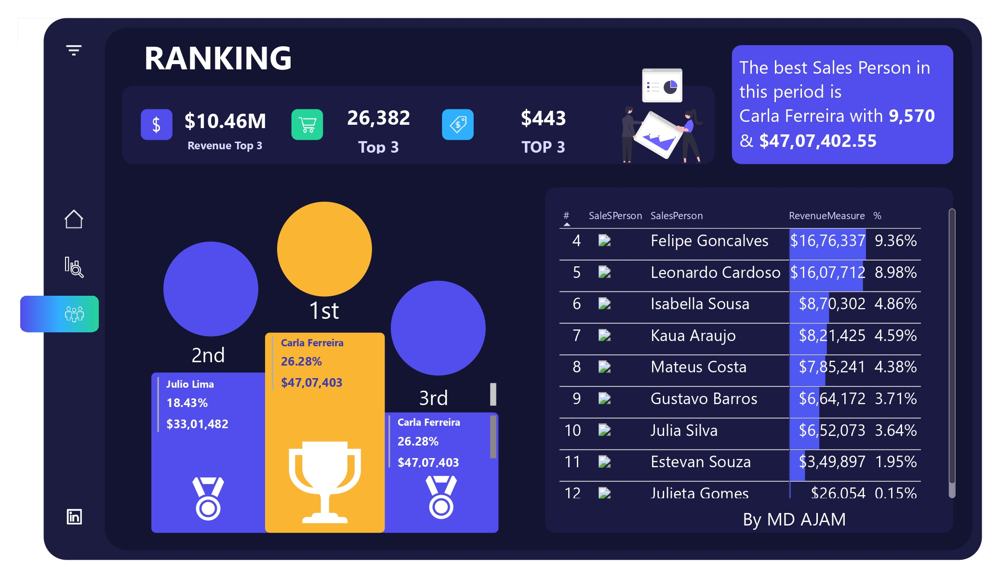

# 📊 Business Sales Performance Dashboard – Food & Beverage Industry  

## 📌 Project Overview    
This project is a **Sales Insights Dashboard for F&B businesses** built using Power BI.  
It helps restaurants, cafes, and food distributors quickly understand their sales trends, identify top-selling items, and make data-driven decisions to increase revenue and optimize operations.

---

## 🎯 Key Business Insights  
- **Revenue Growth**: Achieved **$179M** in sales from 52,560 orders with an **Average Transaction Price (ATP) of $340.74**.  
- **Channel Analysis**: Retail, Distributor, and Online channels clearly highlight how **multi-channel strategies** impact overall performance.  
- **Product Insights**: Key revenue drivers are **Wheat Flour, Oil, and Yeast**, showing where the company should focus marketing and supply chain resources.  
- **Employee Performance**: Salesperson ranking identifies **top contributors**, supporting recognition and incentive planning.  
- **Target Achievement**: Sales exceeded expectations by **103.7% vs Budget**, reflecting effective business strategy execution.  

---

## 🛠️ Role of Business Analyst  
- **Requirement Gathering** – Defined KPIs with stakeholders for better alignment of business goals.  
- **Data Analysis & Interpretation** – Converted raw sales data into **business insights** for leadership.  
- **Visualization Storytelling** – Designed an intuitive **Power BI dashboard** that simplifies complex sales trends.  
- **Business Recommendations** – Suggested actions like **channel optimization, product prioritization, and employee performance evaluation**.  

---

## 📈 Business Value  
- Enables executives to **track performance vs budget in real-time**.  
- Helps management identify **market opportunities** in high-performing product categories.  
- Supports **decision-making for channel strategies and salesforce effectiveness**.  
- Provides a scalable reporting solution for **growing businesses across Saudi, Dubai, and India markets**.  

---
## 🖼️ Dashboard Preview  
Here’s a quick look at the **Power BI dashboard** designed for the **Food & Beverage industry in India**.  
It highlights **Revenue, Orders, Channels, Products, and Employee Performance** with clear insights.  

### 🔹 Main Dashboard View  

## 🛠️ Tools Used  
- **Power BI** – Dashboard design & visualization  
- **Excel / CSV** – Data sources  
- **Business Analysis Skills** – KPI definition, stakeholder communication, insights generation  

---
## How to Use
1. Download the `.pbix` file from this repository.  
2. Open it in Power BI Desktop.  
3. Use the filters and slicers to explore sales by date, product, or channel.  
4. Hover over charts for detailed insights.  
5. Export visuals or reports as needed for presentations or management.

---

## 👤 Author  
**Md Ajam**  
Business & Data Analyst | Sales Performance | Power BI | SQL 

📩 Email: mdajamansari099@gmail.com  
🔗 [LinkedIn](https://www.linkedin.com/in/mdajam/) | [GitHub](https://github.com/MdAjams)  

## Contact
For inquiries or freelance projects:  
**Email:** mdajamansari099@gmail.com  
**LinkedIn:** [Md Ajam](https://www.linkedin.com/in/mdajam/)
